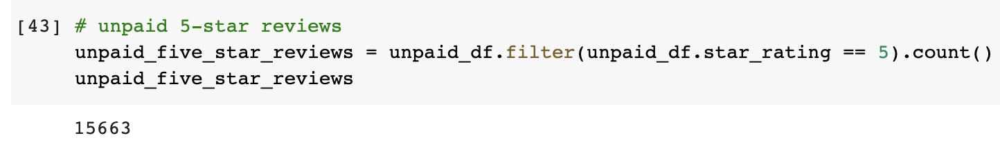

# Amazon_Vine_Analysis

## Table of Contents
* [Project title](#project-title)
* [Technologies](#technologies)
* [Overview](#overview)
* [Results](#results)
* [Summary](#summary)

## Project title
Amazon Vine Analysis

## Technologies
[Google Colab Notebook](https://colab.research.google.com/)
[pgAdmin 4](https://www.pgadmin.org/download/)
[AWS](https://us-east-2.console.aws.amazon.com/console/home?region=us-east-2)

## Overview 

The Amazon Vine program is a service that allows manufacturers and publishers to receive reviews for their products. Companies like SellBy pay a small fee to Amazon and provide products to Amazon Vine members, who are then required to publish a review. By using PySpark, Pandas, or SQL, I was able to analyze Amazon reviews written by members of the paid Amazon Vine program and determine if there is any bias toward favorable reviews from Vine members in the given [dataset](https://s3.amazonaws.com/amazon-reviews-pds/tsv/amazon_reviews_us_Video_Games_v1_00.tsv.gz).

## Results

# Total Number of reviews
* "paid" == "Vine Reviews":

* "unpaid" == "Non-Vine Reviews":

# Total number of 5-star reviews
* Vine Reviews:

* Non-Vine Reviews:

# Percentage of 5-star reviews
* Vine Reviews:

* Non-Vine Reviews:

To determine if there was any positivity bias for reviews in the Vine program, we can take a look at the "Percentage of 5-star reviews" results. 
The given data had 48 Vine reviews that had 5 stars and 15663 Non-Vine reviews that had 5 stars and 51% of the reviews in the Vine program were 5 stars reviews whereas the percentage in the non-Vine reviews is 39%. Even though the number of Vine reviews are significantly lower than the Non-Vine reviews, over 50% of its paid reviews gave 5 stars shows that there is a positivity bias for reviews in the Vine program.
